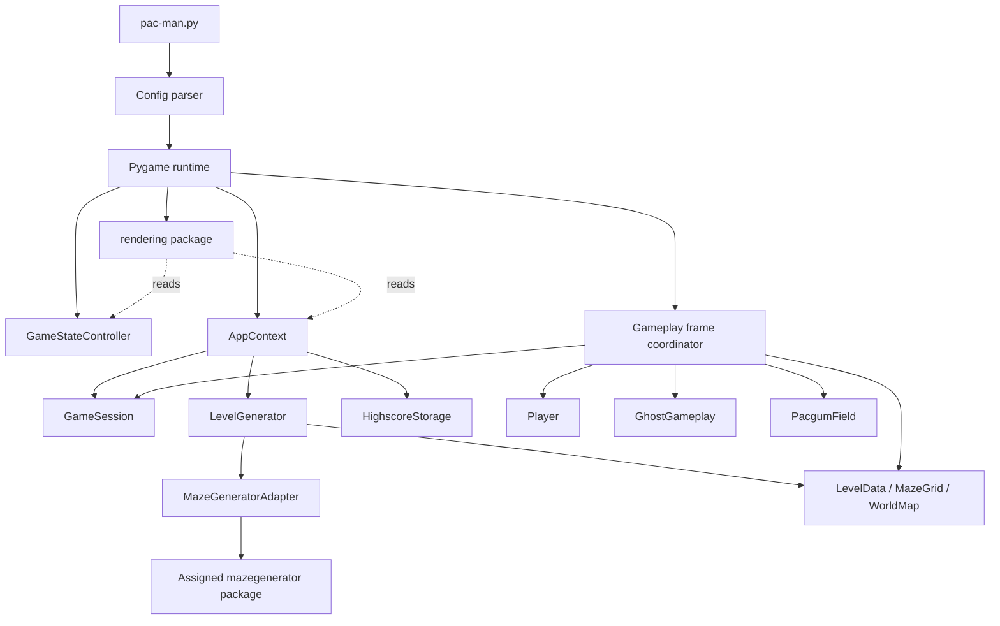

*This project has been created as part of the 42 curriculum by jmanani, mlagutin.*

# Pacman

## Description

A modular, object-oriented recreation of the classic arcade game Pac-Man developed in Python 3.10+ as part of the 42 curriculum. The project combines modern Python development practices (`uv`, strict typing with `mypy`, `flake8` compliance) with authentic arcade game logic, integrating an external maze generation package, autonomous ghost AI behaviors, persistent highscores, and a fault-tolerant configuration system.

The current implementation provides:
- Validated maze generation with reachable corridor normalization.
- Full player mechanics: four-directional grid movement, buffered turning, and wall collision.
- Pellet systems: normal pacgums and corner super-pacgums (power pellets).
- Complete four-ghost autonomous AI: distinct chase targeting for Blinky, Pinky, Inky, and Clyde; frightened fleeing; score chaining; delayed corner respawn; and frame contact protection.
- Session lifecycle: scoring, lives, level timers, pause/resume, and multi-level progression.
- Robust commented-JSON configuration parsing and persistent highscores.
- Automated unit, integration, soak, and headless playtest verification.

## Instructions

### Requirements

- Python 3.10 or newer
- [uv](https://docs.astral.sh/uv/)
- Git

The assigned `mazegenerator` wheel is included in the repository.

### Installation and Execution

Install dependencies and configure git hooks:
```bash
make install
```

Run the application with default configuration (`config.json`):
```bash
make run
```

Direct CLI invocation:
```bash
uv run python pac-man.py config.json
```

Alternatively, after activating the project environment, use the exact
subject-compatible command:
```bash
source .venv/bin/activate
python3 pac-man.py config.json
```

### Controls

The current application supports the state controls below:

| Key | Action |
| --- | --- |
| `Enter` / `Space` | Start game from menu or confirm name on end screen |
| `P` | Pause or resume the active gameplay session |
| `Esc` | Return to main menu from playing, paused, or end screen |
| `W`, `A`, `S`, `D` / `Ц`, `Ф`, `Ы`, `В` / Arrows | Buffer directional turns for Pac-Man |
| Close window | Quit the application |

### Cheat Mode Controls

Cheat mode is intended for peer review and evaluation. Press `F1` during
gameplay to enable or disable it. When enabled, the game displays the complete
control map below the HUD so evaluation controls do not need to appear on the
regular player instructions screen.

| Key | Cheat action |
| --- | --- |
| `F1` | Enable or disable cheat mode |
| `1` | Toggle player invincibility |
| `2` | Skip the current level |
| `3` | Toggle ghost freeze |
| `4` | Add an extra life |
| `5` | Toggle the player speed boost |

### Development Commands

| Command | Purpose |
| --- | --- |
| `make install` | Install runtime and development dependencies |
| `make run` | Run the application with `config.json` |
| `make debug` | Run the application with Python's built-in debugger |
| `make test` | Execute the complete automated test suite |
| `make lint` | Run flake8 and standard mypy checks |
| `make lint-strict` | Run flake8 and mypy strict mode |
| `make preview-mazes` | Display three generated levels in terminal |
| `make clean` | Remove temporary cache files |

## Configuration

Configuration is loaded from a JSON file that supports full-line `#` and `//`
comments. Missing keys use the documented fallbacks, while invalid values emit
clear warnings and either fall back or clamp to their safe minimums. An
unreadable or malformed configuration starts the game with the complete default
configuration instead of exposing a traceback. Unknown keys are safely ignored.

### Key Schema and Fallbacks

The bundled `config.json` defines ten 14x14 native maze levels, a 90-second
limit, and fixed seed `43` for its repeatable first-level layout. The values
below are parser fallbacks used when settings are omitted or invalid.

| Key | Type | Fallback | Description |
| --- | --- | --- | --- |
| `highscore_filename` | string | `highscores.json` | Path to persistent highscore JSON file |
| `pacgum` | integer | `42` | Optional normal pacgum limit (minimum: 1); the fallback remains inactive when the key is omitted, so eligible corridors are filled |
| `lives` | integer | `3` | Starting lives for the player (minimum: 1) |
| `points_per_pacgum` | integer | `10` | Score awarded per normal pacgum (minimum: 0) |
| `points_per_super_pacgum` | integer | `50` | Score awarded per super-pacgum (minimum: 0) |
| `points_per_ghost` | integer | `200` | Base score awarded for eating a frightened ghost (minimum: 0) |
| `frightened_duration` | float | `7.0` | Duration in seconds of ghost frightened mode (minimum: 0) |
| `ghost_respawn_delay` | float | `5.0` | Time in seconds an eaten ghost spends respawning (minimum: 0) |
| `seed` | integer | `42` | Deterministic seed for Level 1 generation |
| `level_max_time` | integer | `90` | Time limit (seconds) allowed per level |
| `levels` | array | `[{"width": 21, "height": 21}]` | Per-level maze dimensions (minimum: 5x5) |

## Maze Generation

The game uses the assigned external `mazegenerator` package as installed,
without modifying its source code. Pacman keeps package-specific calls behind
its own adapter so the gameplay and rendering layers depend only on the
project's validated grid model.

- **Adapter Pattern:** `MazeGeneratorAdapter` translates the assigned package interface and wall bitmasks into Pacman's internal model.
- **Imperfect Mazes:** Every package request sets `perfect=False`. A perfect maze has only one route between cells; disabling that mode allows interconnected corridor loops that support Pac-Man movement and ghost pursuit.
- **Grid Normalization:** Converts external wall bitmasks into an immutable 2D grid of walls and corridors, validating boundaries and entry/exit reachability.
- **Deterministic vs. Random:** Level 1 uses the fixed seed from `config.json` (`43` in the bundled configuration) and preserves the package's central `42` blocked-cell marker; subsequent levels generate procedural mazes using random seeds without the marker.
- **Entity Spawns & Pellets:** Computes the central player spawn, four corner ghost spawns, four corner-oriented super-pacgums, and either fills reachable corridors with normal pacgums or uses an explicit configured normal pacgum count.
- **Failure Handling:** Missing or incompatible package installations, package exceptions, malformed wall data, invalid boundaries, and unreachable exits are converted into clear application errors without a traceback. If a later level cannot be generated, the current score, lives, level, and timer remain unchanged and the application returns safely to the main menu.

## Highscores

The highscore subsystem provides persistent score tracking across game sessions:

- **Storage Format:** Stored as human-readable JSON (`highscores.json`).
- **Validation:** Player names are restricted to 1–10 alphanumeric characters and spaces; scores must be non-negative integers.
- **Capacity & Ordering:** Retains the top 10 highest scores sorted in descending order.
- **Fault Tolerance:** A missing storage file starts with an empty highscore list. Unreadable, empty, corrupt, or invalid data emits a warning and also falls back safely without interrupting gameplay.
- **Safe Writes:** Updates are written to a temporary file and then atomically replace the previous file. If saving fails, the existing highscores remain active and a warning is displayed.
- **Design Rationale:** JSON was chosen for transparent inspection, ease of debugging, cross-platform portability, and straightforward serialization without external database dependencies.

## Implementation

The implementation separates Pygame orchestration and presentation from
testable gameplay, maze, and persistence components.

### Key Classes and Relationships

| Class or component | Responsibility | Collaborates with |
| --- | --- | --- |
| `AppContext` | Owns the active configuration, session, level, player, ghost coordinator, and highscore storage | `GameSession`, `LevelGenerator`, `Player`, `GhostGameplay`, `HighscoreStorage` |
| `GameStateController` | Controls transitions between menus, playing, paused, Game Over, Victory, highscores, instructions, and the main menu | Runtime input handlers and `GameSession` |
| `GameSession` | Tracks score, lives, current level, remaining time, pause state, and completion state | Gameplay, progression, HUD, and highscore flows |
| `LevelGenerator` and `LevelData` | Build a complete playable level from configuration, including maze, world coordinates, spawns, pellets, seed, and time limit | `MazeGeneratorAdapter`, spawn selection, and pacgum placement |
| `MazeGeneratorAdapter` | Adapts and validates the assigned external package output | External `mazegenerator` package and `MazeGrid` |
| `MazeGrid` and `WorldMap` | Represent tile topology and continuous collision geometry | Player movement, ghost movement, rendering, and spawn selection |
| `Player` | Stores continuous position, buffered direction, movement speed, and wall-safe movement rules | `WorldMap` and the gameplay frame coordinator |
| `GhostGameplay` | Coordinates four ghosts, frightened timing, movement, collisions, freezing, eating, and round resets | `Ghost`, `PowerState`, `GhostCollisionGuard`, `Player`, and `GameSession` |
| `HighscoreEntry` and `HighscoreStorage` | Validate, order, load, and atomically save the Top 10 scores | `AppContext` and the completed-game input flow |
| `rendering/` | Renders menus, information screens, gameplay entities, HUD feedback, and completion screens | Reads application state without owning gameplay rules |

### Gameplay Rules

- **Coordinates and collisions:** `TileCoordinate` identifies integer maze
  cells, while `WorldPosition` stores continuous entity positions. `WorldMap`
  converts between them and provides walkability, bounds, and collision
  queries.
- **Player movement:** `Player` uses `queued_direction` for responsive buffered
  turns and applies movement only when the resulting world position remains
  valid.
- **Pacgums and power:** The frame coordinator collects each pellet once,
  updates the score, and activates the shared frightened timer after a
  super-pacgum.
- **Progression:** `GameSession` retains score and remaining lives while a new
  `LevelData` instance replaces the completed level and resets its timer.

### Ghost AI System

Each ghost identity uses a distinct chase target:

- **Blinky (Red):** Direct target chase targeting Pac-Man's current tile.
- **Pinky (Pink):** Ambush targeting 4 tiles ahead of Pac-Man's facing direction.
- **Inky (Cyan):** Complex vector targeting using a pivot 2 tiles ahead of Pac-Man reflected across Blinky's position.
- **Clyde (Orange):** Proximity-based targeting: chases Pac-Man when farther than 8 tiles away; retreats to home corner when closer.
- **Frightened Mode:** Speed reduced by 50%; chooses legal directions maximizing distance from Pac-Man (with seeded pseudo-random tie breaking).
- **Arcade Score Chaining:** Consecutive ghosts eaten within a single power activation award doubling points ($200 \rightarrow 400 \rightarrow 800 \rightarrow 1600$).
- **Frame Collision Guard:** `GhostCollisionGuard` prevents multiple life losses during continuous overlap frames and resolves multi-ghost contacts deterministically.

## General Software Architecture

The codebase follows a modular package architecture with explicit
responsibilities:

```
pacman/
├── application/       # Application context, state transitions, Pygame contracts, runtime loop
├── gameplay/          # Player, ghosts, collisions, scoring, lives, power state, progression
├── maze/              # External generator adapter, grid normalization, spawns, world geometry
├── infrastructure/    # Commented JSON configuration, highscore models, file storage
└── app.py             # Public facade maintaining backward compatibility
```

| Package | Key Modules | Responsibility |
| --- | --- | --- |
| `application/` | `state.py`, `context.py`, `runtime.py`, `gameplay_loop.py`, `rendering/` | State machine, live gameplay coordination, focused rendering components, Pygame event loop |
| `gameplay/` | `player.py`, `ghost.py`, `ghost_collision.py`, `ghost_gameplay.py`, `power_state.py`, `lives.py`, `progression.py` | Game rules, physics, AI pathfinding, collision resolution, lifecycle |
| `maze/` | `adapter.py`, `grid.py`, `level_generator.py`, `spawns.py`, `world.py` | External maze adaptation, grid normalization, level construction |
| `infrastructure/` | `config.py`, `highscore.py`, `storage.py` | Safe configuration parsing and robust JSON highscore persistence |

### Architecture Overview



Solid arrows show orchestration or ownership. Dotted arrows show that rendering
reads the current application state without changing the gameplay rules.

### Main Application Flows

| Flow | Sequence |
| --- | --- |
| Startup | `pac-man.py` validates the single config argument, parses safe settings, and starts the Pygame runtime, which creates the controller, menus, and `AppContext` |
| New game | `AppContext` resets transient state, generates Level 1, creates the player and four ghosts, and initializes the configured timer and lives |
| Gameplay frame | Runtime input queues a direction; the frame coordinator updates the player, collects pellets, updates ghosts and power state, resolves collisions, then checks level completion |
| Player death | Collision resolution removes at most one life per frame; a surviving player and all ghosts return to their assigned spawns with transient round state cleared |
| Level completion | Progression generates the next level before advancing the session, preserves score and lives, resets the timer, and installs new level entities; the final level enters Victory |
| Completed game | Game Over or Victory accepts a validated player name, updates persistent Top 10 scores, and returns cleanly to the main menu |
| Rendering | The dispatcher selects a screen from `GameState`; gameplay rendering converts shared world coordinates into a centered viewport and draws the current entities and HUD |

### Important Implementation Trade-offs

| Decision | Benefit | Trade-off |
| --- | --- | --- |
| Keep gameplay rules independent from Pygame drawing | Rules can be tested headlessly and reused by runtime, soak, and integration tests | `AppContext` and the frame coordinator must explicitly connect state to rendering |
| Use a central `AppContext` instead of module-level globals | Session resets are predictable and dependencies remain visible | The context coordinates several long-lived application objects |
| Adapt the assigned maze package behind `MazeGeneratorAdapter` | Package-specific formats and failures do not leak into gameplay code | External output requires normalization and defensive validation |
| Separate tile and continuous world coordinates | Maze topology stays simple while movement and collisions remain smooth | Conversions must be applied consistently at gameplay and rendering boundaries |
| Use JSON highscore storage instead of a database | Scores are portable, readable, and easy to inspect during evaluation | Atomic file replacement and corruption handling must be implemented locally |
| Use a rendering package with focused modules | Menus, gameplay, information, and completion screens remain easier to review | A dispatcher is required to assemble the correct screen |
| Use a fixed first-level seed and random later seeds | Evaluation starts reproducibly while later playthroughs remain varied | Only Level 1 is exactly reproducible without supplying an explicit seed |

## Project Management

The project is developed using Jira (issue key prefix `PK-`) and GitHub pull requests following trunk-based development with peer reviews and continuous automated testing.

Detailed project management records, engineering decision logs, sprint ownership, and phase delivery histories are maintained in the [`project_management/`](project_management/) directory:
- [`phase_history.md`](project_management/phase_history.md): Delivery history and phase reviews through the completed Phase 7 gameplay review.
- [`bug_triage.md`](project_management/bug_triage.md): Acceptance defect triage register, reproduction evidence, severity classifications, and resolutions (PK-93).
- [`README.md`](project_management/README.md): Team workflow, branch protection rules, and shared engineering standards.

## Resources

### References
- [Python 3 Documentation](https://docs.python.org/3/)
- [Pygame Documentation](https://www.pygame.org/docs/)
- [The Pac-Man Dossier (Jamey Pittman)](https://pacman.holycow.com/) for authentic ghost targeting rules and timing algorithms.
- [pytest Documentation](https://docs.pytest.org/)
- [mypy Documentation](https://mypy.readthedocs.io/)

### AI Usage Disclosure

AI was used as a collaborative learning and review tool to discuss the subject,
identify implementation risks, propose tests, and improve documentation. It
also supported analysis of gameplay edge cases, code reviews, static type
verification, and discussions about modular architecture.

Every accepted change was reviewed, discussed, and tested before it was
committed. The project authors remain responsible for understanding,
explaining, and maintaining all submitted code and documentation.
