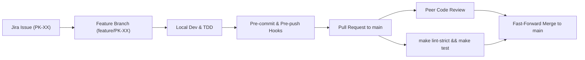

# Team Organisation & Workflow

This document outlines the team roles, collaborative methodologies, development
workflow, quality gates, and Definition of Done (DoD) for the 42 Pac-Man project.

---

## 1. Team Composition & Roles

The project is developed by a collaborative two-person team:

| Member | 42 Login | Primary Focus Areas |
| :--- | :--- | :--- |
| **Jayesh Manani** | `jmanani` | Project infrastructure, domain architecture, physics/movement, soak testing, vector rendering, packaging |
| **Mariia Lagutina**| `mlagutin` | Build automation, maze adaptation, collision algorithms, state management, UI flows, documentation |

---

## 2. Progressive Pairing & Planning Model

Rather than permanently siloing team members into isolated roles (e.g. "backend"
vs. "frontend"), the team adopted a **Progressive Pairing Model**:
- **Iterative Task Pulling:** Tasks are prioritized in Jira (key prefix `PK-`)
  and tracked in the progressive sprint planner.
- **Collaborative Architectural Spikes:** Critical boundaries (such as the maze
  adapter contract in Phase 3, the `AppContext` refactoring in Phase 4, and the
  ghost state lifecycle in Phase 5) are co-designed and reviewed jointly
  (`Team` designation in phase histories).
- **Reciprocal Peer Review:** Every feature branch authored by one member must
  be reviewed, tested, and approved by the other member before merging into
  `main`.

---

## 3. Development Workflow & Quality Gates

### Git Branching & Merge Standards
1. **Trunk-Based Delivery:** All pull requests target `main`. Long-lived staging
   branches are prohibited.
2. **Branch Refresh:** Branches are rebased or refreshed from `main` prior to
   final review to eliminate integration drifts.
3. **Automated Enforcement:**
   - Pre-commit hooks verify Python syntax and formatting.
   - Pre-push hooks run `make lint` and the automated test suite.

---

## 4. Definition of Done (DoD)

A Jira ticket or phase deliverable is considered **Done** only when all of the
following criteria are met:

1. **Functional Correctness:** Implements the agreed feature or rule specified
   in the user story and adheres to the 42 subject.
2. **Type Safety:** Full type annotations on all function signatures, parameters,
   and return types. Zero errors under `make lint-strict` (`mypy --strict`).
3. **Coding Standards:** 100% compliance with `flake8` and PEP 257 docstrings on
   all public classes, methods, and functions.
4. **Automated Testing:** Dedicated unit and/or integration tests added or
   updated. Existing test suite passes without failure (`make test`).
5. **Robustness & Zero Crashes:** No unhandled exceptions, raw tracebacks, or
   silent failures. Graceful fallback on malformed or missing inputs.
6. **Peer Review:** Code reviewed and approved by the other team member.
7. **Delivery Evidence:** Dated entry added to `project_management/phase_history.md`
   and relevant documentation updated.

---

## 5. Comprehensive Ownership Matrix

| Phase | Jira Stories | Focus Area | Owner | Reviewer |
| :--- | :--- | :--- | :---: | :---: |
| **Phase 0** | PK-7, PK-8 | Makefile targets, quality tools, test runner | Mariia | Jayesh |
| | PK-2, PK-21, PK-27, PK-28 | Git hooks, uv workflow, PM repository setup | Jayesh | Mariia |
| **Phase 1** | PK-12, PK-13, PK-14 | Pygame window, state controller, placeholder UI | Mariia | Jayesh |
| | PK-11, PK-15, PK-16 | CLI parser, AppContext boundaries, event cycle | Jayesh | Mariia |
| **Phase 2** | PK-30 to PK-33 | Commented JSON parser, config fallbacks & tests | Jayesh | Mariia |
| | PK-34 to PK-38 | Highscore validation, atomic storage, persistence | Mariia | Jayesh |
| **Phase 3** | PK-40 | Maze adapter contract & boundary design | **Team** | Team |
| | PK-41, PK-42, PK-43, PK-46 | Adapter implementation, grid normalization, pacgums | Mariia | Jayesh |
| | PK-44, PK-45, PK-48 | Level generator, deterministic/random spawns | Jayesh | Mariia |
| **Phase 4** | PK-50, PK-55 to PK-57, PK-59| Tile coordinates, collisions, lives, timer, pause | Mariia | Jayesh |
| | PK-51 to PK-54, PK-58 | Movement, turn buffering, pellet collection, scoring | Jayesh | Mariia |
| | PK-60 | AppContext decoupling & architecture review | **Team** | Team |
| **Phase 5** | PK-62 | Ghost state machine contract | **Team** | Team |
| | PK-63 to PK-65 | Autonomous movement, chase targeting, fleeing | Jayesh | Mariia |
| | PK-66 to PK-69 | Frightened timer, edible ghost collision, respawn | Mariia | Jayesh |
| | PK-70 | Complete ghost behaviour playtest review | **Team** | Team |
| **Phase 6** | PK-76, PK-79 to PK-81, PK-83| Menu navigation, in-game HUD, pause, vector sprites | Jayesh | Mariia |
| | PK-77, PK-78, PK-82 | Highscores screen, instructions screen, name input | Mariia | Jayesh |
| | PK-84 | Full gameplay journey & session isolation review | **Team** | Team |
| **Phase 7** | PK-86 to PK-88 | Cheat mode activation, invincibility, freeze, speed | Mariia | Jayesh |
| | PK-89, PK-90 | Boundary audit, resource cleanup, multi-cycle tests | Jayesh | Mariia |
| | PK-91 | Live config testing, dual-mode pacgum placement | Mariia | Jayesh |
| | PK-92 | Headless soak simulation, timer precision fixes | Jayesh | Mariia |
| | PK-93 | Defect triage register (`bug_triage.md`) | **Team** | Team |
| | PK-94 | Live Pygame gameplay review & visual polish | **Team** | Team |
| **Phase 8** | PK-96, PK-97, PK-98 | README, config/storage docs, architecture | Mariia | Jayesh |
| | PK-99 | Project management update & progress evidence | **Team** | Team |
| | PK-100 to PK-102 | Packaging script, packaged instructions, publishing | Jayesh | Mariia |
| | PK-103 | Clean-machine acceptance, defect fixes, regression verification | **Team** | Team |
| | PK-105 | Evaluation-only Game Over and Victory cheat hardening | Jayesh | Mariia |
| | PK-106 | Final documentation review, Phase 8 closure, and readiness verification | Mariia | Jayesh |
