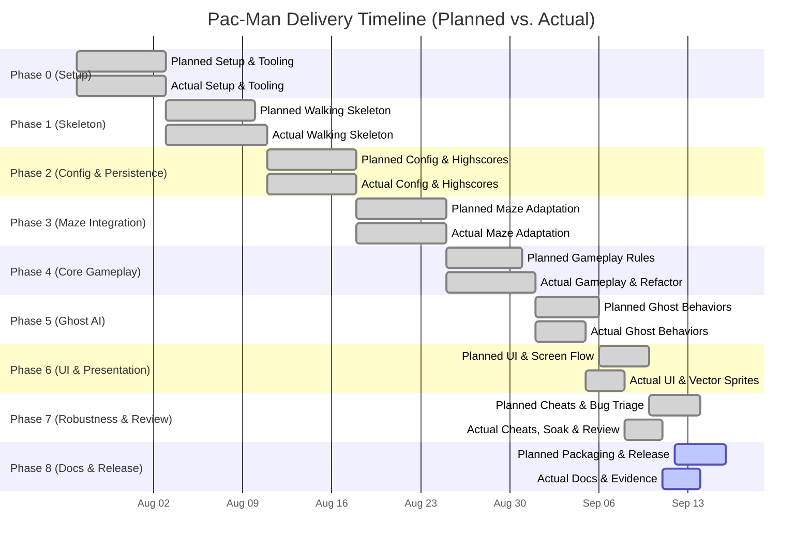

# Project Timeline & Progress Tracking

This document records the planned vs. actual schedule, milestone delivery dates,
sprint progression, and variance analysis for the 42 Pac-Man project. It
provides dated engineering evidence in compliance with Chapter VIII of the 42
subject.

---

## 1. Timeline Overview (Planned vs. Actual)

---

## 2. Phase-by-Phase Milestone Tracking

| Milestone | Phase Focus | Planned Window | Actual Window | Variance | Status | Primary Evidence |
| :--- | :--- | :---: | :---: | :---: | :---: | :--- |
| **M0** | **Setup & Tooling** | 2026-07-27 – 2026-08-03 | 2026-07-27 – 2026-08-03 | 0 days | Delivered | `Makefile`, `pyproject.toml`, git hooks (PK-2, PK-7, PK-8, PK-21, PK-27) |
| **M1** | **Walking Skeleton** | 2026-08-03 – 2026-08-10 | 2026-08-03 – 2026-08-11 | +1 day | Delivered | CLI entry point, pygame window, state controller (PK-11 to PK-16) |
| **M2** | **Config & Highscores** | 2026-08-11 – 2026-08-18 | 2026-08-11 – 2026-08-18 | 0 days | Delivered | Commented-JSON parser, Top 10 JSON persistence (PK-30 to PK-38) |
| **M3** | **Maze Integration** | 2026-08-18 – 2026-08-25 | 2026-08-18 – 2026-08-25 | 0 days | Delivered | Adapter for `mazegenerator`, grid normalization, spawns (PK-40 to PK-48) |
| **M4** | **Core Gameplay** | 2026-08-25 – 2026-08-31 | 2026-08-25 – 2026-09-01 | +1 day | Delivered | Movement, collision, scoring, lives, timer, `AppContext` refactor (PK-50 to PK-60) |
| **M5** | **Ghost AI** | 2026-09-01 – 2026-09-06 | 2026-09-01 – 2026-09-05 | -1 day | Delivered | 4 autonomous AIs, frightened mode, delayed respawn (PK-62 to PK-70) |
| **M6** | **UI & Full Flow** | 2026-09-06 – 2026-09-10 | 2026-09-05 – 2026-09-08 | -2 days | Delivered | Main menu, HUD, pause, game-over, victory, vector sprites (PK-76 to PK-84) |
| **M7** | **Cheats, Soak & Triage** | 2026-09-10 – 2026-09-14 | 2026-09-08 – 2026-09-11 | -1 day | Delivered | F1 cheats, 50k soak test, timer drift fix, bug triage (PK-86 to PK-94) |
| **M8** | **Docs, Packaging & Release** | 2026-09-12 – 2026-09-16 | 2026-09-11 – Present | On Track | In Progress | Documentation (PK-96 to PK-99), packaging/publishing (PK-100 to PK-102), clean-machine acceptance (PK-103) |

---

## 3. Timeline Variance Analysis

### Variance 1: Phase 1 Walking Skeleton (+1 day)
- **Planned:** Conclude by Aug 10, 2026.
- **Actual:** Completed on Aug 11, 2026.
- **Root Cause:** Initial design discussion around whether domain state should live directly inside Pygame callbacks or behind an abstract application boundary.
- **Impact & Mitigation:** Established the `AppContext` architectural boundary in PK-15. The 1-day investment avoided massive refactoring during later gameplay stages.

### Variance 2: Phase 4 Architecture Review (+1 day)
- **Planned:** Conclude by Aug 31, 2026.
- **Actual:** Completed on Sep 01, 2026.
- **Root Cause:** As core gameplay features expanded, `pacman/app.py` grew to 446 lines, mixing Pygame rendering, event dispatching, and game rules. The team chose to halt new feature work to split the file into `pacman/application/` and maintain headless testability.
- **Impact & Mitigation:** Resulted in ADR-03. Preserved 100% backward compatibility and made Phase 5 ghost AI integration significantly faster.

### Variance 3: Phase 5 & 6 Acceleration (-3 days combined)
- **Planned:** Conclude by Sep 10, 2026.
- **Actual:** Completed on Sep 08, 2026.
- **Root Cause:** Because the domain rules were completely isolated from Pygame in Phase 4, ghost pathfinding and screen transitions could be implemented and verified via fast headless unit tests without waiting for graphical rendering.
- **Impact & Mitigation:** Gained 3 calendar days, which were immediately reallocated to deep robustness and soak testing in Phase 7.

### Variance 4: Phase 7 Scope Expansion into Soak Testing
- **Planned:** Standard cheat mode and manual evaluation review (4 days).
- **Actual:** Completed in 3 days (Sep 08 – Sep 11, 2026), but with expanded scope: added 50,000-tick automated soak tests, floating-point drift fixes, and a formal defect triage register (`bug_triage.md`).
- **Impact & Mitigation:** Caught and eliminated subtle floating-point precision bugs (BUG-01) before release.

---

## 4. Work-in-Progress & Release Horizon (Phase 8)

Phase 8 is scheduled from September 11 to September 16, 2026:
- **Completed (Sep 11 – 14):**
  - PK-96: Comprehensive README with subject requirements, controls, and cheats.
  - PK-97: Configuration model and highscore persistence documentation.
  - PK-98: Complete software architecture, package boundaries, and Mermaid flow diagrams.
  - PK-99: Project management update (timeline, decisions, risks, team, acceptance tests, blockers).
  - PK-100: Reproducible standalone package and distributable archives.
  - PK-101: Packaged-game controls and configuration instructions.
  - PK-102: Public Itch.io deployment and launch demonstration.
  - PK-103: Team clean-machine acceptance, defect fixes, and regression verification.
- **Upcoming (Sep 14 – 16):**
  - Final release rebuild after accepted fixes.
  - Joint documentation/release review and final defense rehearsal.
